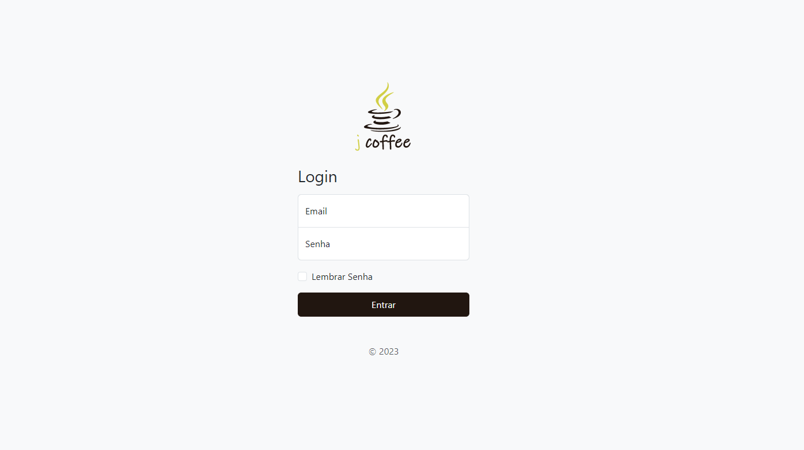
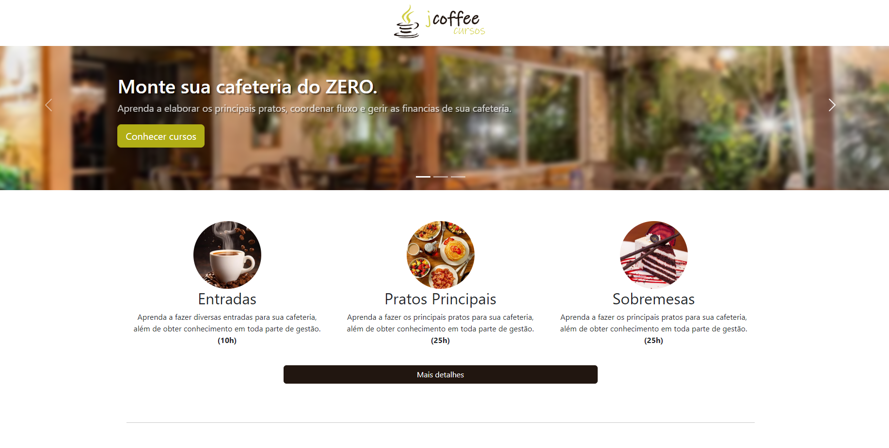
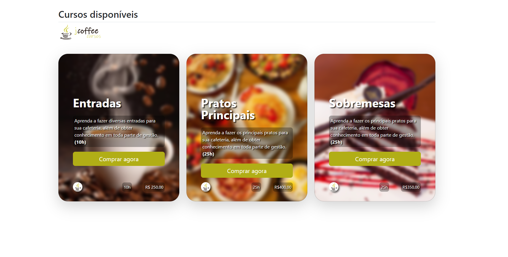

# TAREFA: Bootstrap
## Descrição
O projeto foi desenvolvido para a matéria de Desenvolvimento Web, consiste na utilização de estruturas simples para a criação de uma interface web.

## Tema
O tema do projeto foi definido pelo professor em: Cursos Culinários.
  <i>*Não possui integração com banco de dados, tem apenas objetivo da criação de interface.</i>

##Exemplos

## Publicação
https://github.com/Rafael-MJ/Bootstrap

## Última atualização 13/10/23
